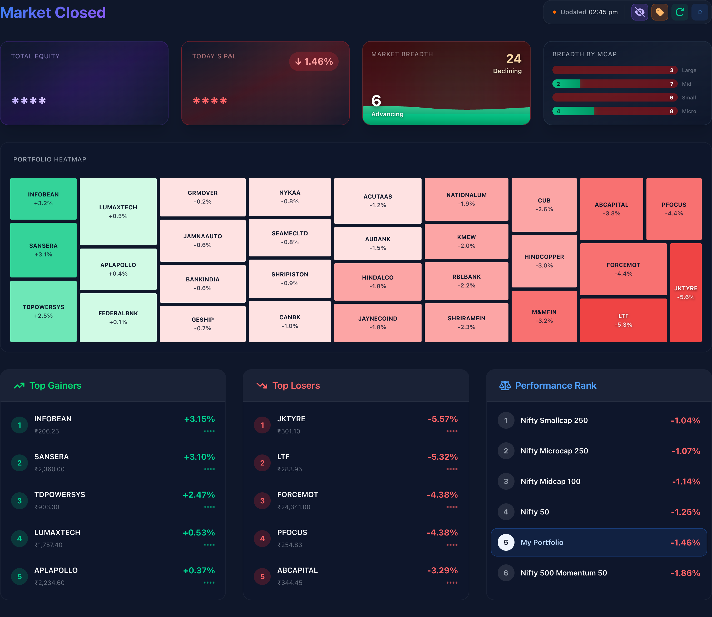

# Alpha Portfolio Tracker

<div align="center">
  
  
</div>

A self-hosted portfolio tracking application for Indian stock markets with real-time market data, historical performance analysis, and comprehensive reporting. Built with Next.js and powered by Upstox API.

> [!NOTE]
> This project has been tested with **Upstox** (for real-time market data, historical prices, and authentication) and **Zerodha Kite** (for order import only). If you use a different broker, you can still use the app by importing trades via Excel, but real-time data and order sync features may require code changes to support your broker's API.

## ✨ Features

- **Real-time Dashboard** — Live portfolio P&L with WebSocket price streaming from Upstox
- **Privacy Mode** — Toggle to hide monetary values on desktop (great for screen sharing)
- **Performance Analytics** — NAV tracking, XIRR, drawdown, benchmark comparisons (NIFTY 50, NIFTY 500 MOMENTUM 50, etc.)
- **Market Cap Classification** — Automatic Large/Mid/Small/Micro cap breakdown using AMFI data
- **Sector Allocation** — Visual treemap and pie charts showing portfolio sector exposure
- **Portfolio Heatmap** — Color-coded view of stock performance across your holdings
- **Intraday P&L Chart** — Minute-by-minute P&L tracking with index overlay
- **Corporate Actions** — Track stock splits, bonuses, and symbol changes with automatic price adjustments
- **Trade Import** — Bulk import trades from Excel/CSV files
- **Historical Snapshots** — Daily, weekly, and monthly portfolio snapshots with time-weighted returns
- **Data Lock** — Protect historical data from accidental recalculation

---

## 🚀 Getting Started

### Prerequisites

- [Node.js](https://nodejs.org/) v18+ and npm
- [Turso CLI](https://docs.turso.tech/cli/installation) (for database)
- An [Upstox](https://upstox.com/) demat account
- [Android Studio](https://developer.android.com/studio) *(Optional: only needed if building the Android app)*

---

### Step 1: Create an Upstox Developer App

1. Go to [developer.upstox.com](https://developer.upstox.com/) and sign in with your Upstox credentials
2. Click **"New App"** and fill in:
   - **App Name**: Any name (e.g., "Alpha Portfolio Tracker")
   - **Redirect URL**: `http://localhost:3000/api/upstox/callback`  
     *(You'll add your Vercel URL here later for production)*
   - **Postback URL / Webhook**: `https://your-vercel-app.vercel.app/api/upstox/webhook`  
     *(Add this after deploying to Vercel)*
3. After creating the app, note down your:
   - **API Key** (also called `client_id`)
   - **API Secret** (also called `client_secret`)

> [!IMPORTANT]
> The Upstox access token expires every 24 hours. The app has a daily cron job that sends a push notification to your phone — you approve it, and the token auto-refreshes. See [Daily Token Refresh](#daily-token-refresh) for setup.

---

### Step 2: Create a Turso Database

```bash
# Install Turso CLI
brew install tursodatabase/tap/turso   # macOS
# or: curl -sSfL https://get.tur.so/install.sh | bash

# Sign up & Login
turso auth signup
turso auth login

# Create your database
turso db create alpha-portfolio

# Get your database URL
turso db show alpha-portfolio --url
# Output: libsql://alpha-portfolio-<your-username>.turso.io

# Create an auth token
turso db tokens create alpha-portfolio
# Output: eyJhb... (save this!)
```

<details>
<summary>💰 Turso Free Tier Limits</summary>

| Feature | Free Tier |
|---------|-----------|
| Databases | 500 |
| Storage | 9 GB |
| Row Reads | 1B/month |
| Row Writes | Unlimited |

More than enough for personal portfolio tracking.

</details>

---

### Step 3: Clone & Configure

```bash
# Clone the repository
git clone https://github.com/<your-username>/Alpha.git
cd Alpha

# Copy environment templates
cp .env.local.example .env.local
cp .env.example .env
```

Edit `.env.local` with your values:

```bash
# Database
DATABASE_URL=libsql://alpha-portfolio-<your-username>.turso.io?authToken=eyJhb...your-token

# Upstox API
UPSTOX_API_KEY=your-api-key-uuid
UPSTOX_API_SECRET=your-api-secret
UPSTOX_REDIRECT_URI=http://localhost:3000/api/upstox/callback
UPSTOX_MOBILE_NUMBER=your-mobile-number
UPSTOX_TOTP_SECRET=your-totp-secret
UPSTOX_PIN=your-pin

# Zerodha Kite Connect (Optional - for order sync)
# ZERODHA_USER_ID=your-user-id
# ZERODHA_PASSWORD=your-password
# ZERODHA_TOTP_SECRET=your-totp-secret
# ZERODHA_API_KEY=your-kite-api-key
# ZERODHA_API_SECRET=your-kite-api-secret
```

---

### Step 4: Install & Initialize

```bash
# Install dependencies
npm install

# Push database schema to Turso
npx prisma db push

# Generate Prisma client
npx prisma generate
```

> [!IMPORTANT]
> **Database Initialization**: You MUST specify `DATABASE_URL` in your `.env.local` for the Prisma CLI to connect to Turso. Run `npx prisma db push` to create the tables in your Turso database. If you see a "no such table" error in the app, it means this step was skipped or failed.

---

### Step 5: Run Locally

```bash
npm run dev
```

Open [http://localhost:3000](http://localhost:3000) in your browser.

#### First-Time Upstox Authentication

1. Go to the **Settings** page (`/settings`)
2. Click **"Browser Login"** — this opens the Upstox OAuth page
3. Log in with your Upstox credentials and authorize the app
4. You'll be redirected back with a success message
5. The access token is now stored in your database (valid for ~24 hours)

---

### Step 6: Import Your Trades

Go to the **Trades** page (`/trades`) and upload an Excel file with your trade history. The expected format:

| Column | Description |
|--------|-------------|
| Date | Trade date (DD-MM-YYYY or YYYY-MM-DD) |
| Symbol | NSE trading symbol (e.g., RELIANCE, TCS) |
| Type | BUY or SELL |
| Quantity | Number of shares |
| Price | Price per share |

After import, the app will automatically:
- Process all transactions chronologically
- Fetch historical prices from Upstox API
- Calculate daily NAV using Time-Weighted Return (TWR)
- Generate daily, weekly, and monthly snapshots
- Compare against benchmark indices

---

## ☁️ Deploy to Vercel

### Step 1: Push to GitHub

```bash
git init
git add .
git commit -m "Initial commit"
git remote add origin https://github.com/<your-username>/Alpha.git
git push -u origin main
```

### Step 2: Import to Vercel

1. Go to [vercel.com](https://vercel.com/) and sign in
2. Click **"New Project"** → Import your GitHub repository
3. In **Environment Variables**, add:

| Variable | Value | Notes |
|----------|-------|-------|
| `DATABASE_URL` | `libsql://...?authToken=eyJhb...` | Turso URL + Auth Token |
| `UPSTOX_API_KEY` | Your API key | From Step 1 |
| `UPSTOX_API_SECRET` | Your API secret | Mark as **Sensitive** |
| `UPSTOX_REDIRECT_URI` | `https://your-app.vercel.app/api/upstox/callback` | ⚠️ Use your Vercel URL |
| `UPSTOX_MOBILE_NUMBER` | Your mobile number | Mark as **Sensitive** |
| `UPSTOX_TOTP_SECRET` | Upstox TOTP Secret | Mark as **Sensitive** |
| `UPSTOX_PIN` | Upstox PIN | Mark as **Sensitive** |
| `CRON_SECRET` | A random string | Required for cron endpoint auth |

> [!TIP]
> If you are using the optional **Zerodha Order Sync**, you should also add the `ZERODHA_*` variables listed in the [Environment Variables Reference](#zerodha-kite-integration) below.

4. Click **Deploy**

> [!WARNING]
> After deploying, go back to [developer.upstox.com](https://developer.upstox.com/) and add your Vercel production URL to the **Redirect URL** field:
> `https://your-app.vercel.app/api/upstox/callback`
> 
> Also add the **Webhook/Postback URL**:
> `https://your-app.vercel.app/api/upstox/webhook`

### Step 3: Set Up Cron Jobs

The app uses external cron jobs to automate daily tasks. Use [cron-job.org](https://cron-job.org/) (free tier is sufficient).

#### How to set up on cron-job.org

1. Sign up at [cron-job.org](https://cron-job.org/) (free account)
2. Click **"Create cronjob"**
3. For each job below, fill in:
   - **Title**: A descriptive name (e.g., "Alpha - Token Refresh Morning")
   - **URL**: `https://your-app.vercel.app` + the endpoint path + `?secret=YOUR_CRON_SECRET`
   - **Schedule**: Use the "Custom" option and paste the cron expression
   - **Time zone**: Set to **UTC** for all jobs
   - **Request method**: **GET**
   - **Notifications**: Enable "on failure" to get alerted if a job fails
4. Click **"Create"** and repeat for each endpoint

> [!IMPORTANT]
> All cron endpoints require authentication via `CRON_SECRET`. Append `?secret=YOUR_CRON_SECRET` to each URL, or set the `Authorization: Bearer YOUR_CRON_SECRET` header. Without this, endpoints return 401 in production.

#### Cron Jobs to Configure

| # | Title | Endpoint | Schedule (UTC) | IST | What it does |
|---|-------|----------|----------------|-----|--------------|
| 1 | Intraday P/L | `/api/cron/intraday-pnl` | `* 4-10 * * 1-5` | Every min (9:30am-4:00pm) | Records P/L every minute to power the Intraday chart. |
| 2 | Token Refresh (AM) | `/api/cron/request-upstox-token` | `30 2 * * 1-5` | 8:00 AM Mon-Fri | Push notification to approve Upstox token. **Crucial for live data.** |
| 3 | Token Refresh (PM) | `/api/cron/request-upstox-token` | `30 14 * * 1-5` | 8:00 PM Mon-Fri | Backup token refresh if morning is missed. |
| 4 | Daily Snapshot | `/api/portfolio/snapshot?type=daily` | `30 10 * * 1-5` | 4:00 PM Mon-Fri | End-of-day portfolio value, NAV, drawdown. |
| 5 | Weekly Snapshot | `/api/portfolio/snapshot?type=weekly` | `0 11 * * 5` | 4:30 PM Fri | Weekly state (market cap, sector, XIRR). |
| 6 | Monthly Snapshot | `/api/portfolio/snapshot?type=month` | `0 0 1 * *` | 5:30 AM 1st of month | Monthly state with full performance stats. |
| 7 | Corp Actions | `/api/cron/corporate-actions` | `30 23 * * *` | 5:00 AM Daily | Syncs splits and bonuses from NSE automatically. |
| 8 | Sector Refresh | `/api/cron/sector-refresh` | `0 6 1 * *` | 11:30 AM 1st of month | Scrapes latest stock-to-sector mappings. |
| 9 | AMFI Sync | `/api/cron/amfi-sync` | `30 0 * * 0` | 6:00 AM Sunday | Weekly check for new market cap classifications. |

> [!TIP]
> After setting up all 6 jobs, you should see them listed in your cron-job.org dashboard. You can manually trigger any job by clicking "Run now" to test it.

---

## ⚙️ Settings Page

The Settings page (`/settings`) is your control center for managing the app:

### Upstox Authentication

Two ways to authenticate:
- **Browser Login** — Opens Upstox OAuth in a new tab. You log in, authorize, and the token is saved via the callback URL.
- **Phone Auth** — Sends a push notification to your Upstox-registered mobile number. Approve it, and the token is delivered via webhook.

The token status bar shows remaining validity (up to 24 hours). A cron job runs daily before market open to request a new token via the phone notification method.

### Daily Token Refresh

Upstox tokens expire every 24 hours. To automate renewal:

1. Set up the **Webhook URL** in your Upstox app settings: `https://your-app.vercel.app/api/upstox/webhook`
2. Set up the cron job for `/api/cron/request-upstox-token` (see cron table above)
3. **Each morning**: The cron job triggers a push notification to your phone → you approve it → the token is delivered to the webhook → stored in your database automatically

No manual login needed after initial setup — just approve the daily notification.

### Data Lock

Set a date to protect all historical snapshot data before that date from being modified or recalculated. Useful once you've verified your historical data is correct.

### Recompute Snapshots

Trigger a full recalculation of portfolio snapshots from your trade history. This processes all transactions chronologically, fetches prices, and regenerates all daily/weekly/monthly snapshots. Use this after importing new trades or fixing data issues.

### Refresh Sector Data

Fetches the latest stock-to-sector mappings (scrapes from Zerodha). This data powers the sector allocation charts. Runs automatically monthly via cron, but can be triggered manually.

---

## 📊 AMFI Market Cap Classification

The app classifies your holdings into Large Cap, Mid Cap, Small Cap, and Micro Cap using official AMFI (Association of Mutual Funds in India) data.

### How to Upload AMFI Data

1. Download the AMFI classification PDF from [amfiindia.com](https://www.amfiindia.com/research-information/other-data/categorization-of-stocks)
2. Go to **Settings** → **AMFI Classification** card
3. Upload the PDF file
4. The app parses it and stores classifications by period (e.g., `2024_H2`)

### Classification Logic

- AMFI releases data twice a year (H1 and H2)
- The **rolling period** logic ensures the previous period's data applies to the current period's snapshots (e.g., `2024_H2` data determines classifications until `2025_H1` data is available)
- **SEBI thresholds**: Large Cap (rank 1–100), Mid Cap (101–250), Small Cap (251–500), Micro Cap (501+)

After uploading new AMFI data, snapshots are automatically recalculated to update the market cap breakdown.

---

## 🏢 Corporate Actions

Go to **Settings** → **Corporate Actions** to manage stock splits, bonuses, and symbol changes.

### Supported Types

| Type | Description | Example |
|------|-------------|---------|
| **SPLIT** | Stock split — adjusts quantity and price | 1:5 split → 100 shares become 500 at 1/5th price |
| **BONUS** | Bonus shares — adds new shares at zero cost | 1:1 bonus → 100 shares become 200 |
| **SYMBOL_CHANGE** | Symbol rename — maps old symbol to new | MCDOWELL-N → UBBL |

### How It Works

1. Add the corporate action with the date, symbol, type, and ratio
2. The app automatically adjusts historical prices and quantities in snapshot calculations
3. No need to modify your original trade data — adjustments are applied during portfolio simulation

> [!NOTE]
> Corporate actions are not auto-detected from any API. You need to manually enter them when they occur for your holdings.

---

## 🕶️ Privacy Mode

Click the **eye icon** in the live dashboard header to toggle privacy mode:
- **On**: All monetary values (portfolio value, P&L, stock values) are masked with `****` on desktop
- **Off**: All values are visible
- **Mobile**: Values are always shown regardless of privacy setting (since you're on your personal device)
- The setting persists across sessions via `localStorage`

---

## 🏗️ Architecture

<details>
<summary>Click to expand</summary>

### Tech Stack

- **Framework**: Next.js 16 (App Router, Turbopack)
- **Database**: Turso (SQLite at the edge)
- **ORM**: Prisma with libsql adapter
- **Market Data**: Upstox API (REST + WebSocket)
- **Styling**: TailwindCSS + Material UI
- **Charts**: Recharts + Nivo

### Architecture Diagram

```
┌─────────────────────────────────────────────────────────────────────┐
│                     Frontend (Next.js App Router)                    │
├─────────────────────────────────────────────────────────────────────┤
│  Live Dashboard │ Historical Dashboard │ Trades │ Settings          │
│       │                │                   │         │              │
│       └────────────────┴───────────────────┴─────────┘              │
│                              │                                      │
│                    Server Actions / API Routes                      │
├─────────────────────────────────────────────────────────────────────┤
│                           Service Layer                             │
│  ┌─────────┐ ┌─────────┐ ┌─────────┐ ┌─────────┐ ┌─────────┐     │
│  │ Upstox  │ │  AMFI   │ │ Finance │ │ Import  │ │ Sector  │     │
│  │ Service │ │ Service │ │ Engine  │ │ Service │ │ Service │     │
│  └────┬────┘ └────┬────┘ └────┬────┘ └────┬────┘ └────┬────┘     │
├───────┼──────────┼──────────┼──────────┼──────────┼─────────────────┤
│       │          │          │          │          │                  │
│  ┌────▼────┐ ┌───▼───┐ ┌───▼───┐ ┌───▼───┐ ┌───▼───┐             │
│  │ Upstox  │ │ AMFI  │ │Prisma │ │ Excel │ │Zerodha│             │
│  │   API   │ │ Files │ │  ORM  │ │ Parse │ │ Scrape│             │
│  └─────────┘ └───────┘ └───┬───┘ └───────┘ └───────┘             │
├──────────────────────────────┼──────────────────────────────────────┤
│                        ┌─────▼─────┐                                │
│                        │   Turso   │                                │
│                        │  Database │                                │
│                        └───────────┘                                │
└─────────────────────────────────────────────────────────────────────┘
```

### Directory Structure

```
src/
├── app/                    # Next.js App Router pages
│   ├── actions/           # Server Actions
│   │   ├── actions.ts     # Core portfolio actions
│   │   ├── auth.ts        # Authentication actions
│   │   ├── amfi.ts        # AMFI classification actions
│   │   ├── live.ts        # Live dashboard data
│   │   └── sectors.ts     # Sector mapping actions
│   ├── api/               # API Routes
│   │   ├── cron/          # Scheduled jobs (token, snapshot, sector)
│   │   ├── stream/        # WebSocket authorization
│   │   ├── upstox/        # OAuth callback, login, webhook
│   │   └── portfolio/     # Snapshot generation
│   ├── dashboard/         # Historical dashboard page
│   ├── settings/          # Settings page (auth, AMFI, corp actions)
│   └── trades/            # Trade management & import
├── components/            # React components
│   ├── live/              # LiveHeader, LiveStatsCards, LiveMovers, IntradayPnLChart
│   └── portfolio/         # PortfolioTable, Heatmap, SectorAllocation
├── context/
│   └── LiveDataContext.tsx # WebSocket + polling data provider
├── hooks/
│   └── useUpstoxStream.ts # WebSocket connection to Upstox (Protobuf V3)
└── lib/                   # Core library code
    ├── upstox/            # Upstox API client & token management
    ├── amfi/              # AMFI classification service
    ├── finance/           # Portfolio valuation engine
    ├── portfolio-engine.ts # Transaction processing
    ├── finance.ts         # Snapshot calculations
    └── db.ts              # Database connection
```

### Database Schema

**Core Tables**: Transaction, DailyPortfolioSnapshot, WeeklyPortfolioSnapshot, MonthlyPortfolioSnapshot

**Support Tables**: StockHistory, IndexHistory, SymbolMapping, AMFIClassification, SectorMapping, UpstoxToken, IntradayPnL

### Real-time Data Flow

```
Page Load → Fetch initial data (Server Action)
               │
               ▼
          Start WebSocket (useUpstoxStream)
               │
               ▼
          Receive price updates → Update holdings → Recalculate totals
```

The browser connects directly to Upstox WebSocket (protobuf messages decoded client-side). This avoids serverless connection limits while providing sub-second price updates.

### Snapshot Calculation

Portfolio history is built through simulation:
1. Process transactions chronologically
2. Fetch daily closing prices from Upstox
3. Apply corporate action adjustments
4. Calculate NAV using Time-Weighted Return (TWR)
5. Save daily/weekly/monthly snapshots
6. Track index benchmarks for comparison

</details>

---

## 🔧 Optional: Zerodha Kite Integration

If you want to auto-sync orders from Zerodha Kite:

> [!NOTE]
> Auto-sync only imports the **current day's executed orders** — it does not import historical trades. For your existing trade history, use the Excel import on the Trades page.

1. Create a Kite Connect app at [kite.trade](https://kite.trade/)
2. Add Zerodha credentials to your `.env.local`:
   ```bash
   ZERODHA_USER_ID=your-user-id
   ZERODHA_PASSWORD=your-password
   ZERODHA_TOTP_SECRET=your-totp-secret
   ZERODHA_API_KEY=your-kite-api-key
   ZERODHA_API_SECRET=your-kite-api-secret
   ```
3. Set up a GitHub Action for daily sync (see `.github/workflows/sync-orders.yml`)
4. Add the same secrets to your GitHub repository **Settings → Secrets**

---

## 🔑 Environment Variables Reference

### Required (Core)

| Variable | Description |
|----------|-------------|
| `DATABASE_URL` | Turso database URL with `?authToken=` appended |
| `UPSTOX_API_KEY` | Upstox API key (client_id) |
| `UPSTOX_API_SECRET` | Upstox API secret |
| `UPSTOX_REDIRECT_URI` | OAuth callback URL |
| `UPSTOX_MOBILE_NUMBER` | Upstox mobile number for auto login |
| `UPSTOX_TOTP_SECRET` | Upstox TOTP secret for auto login |
| `UPSTOX_PIN` | Upstox PIN for auto login |

### Optional — Personalization

| Variable | Used For | Description |
|----------|----------|-------------|
| `APP_USER_NAME` | UI greeting (server) | Display name shown in the app (default: "User") |
| `NEXT_PUBLIC_APP_USER_NAME` | UI greeting (client) | Same as above, for client-side components |

### Optional — Cron Job Security

| Variable | Used For | Description |
|----------|----------|-------------|
| `CRON_SECRET` | Securing cron/admin endpoints | Prevents unauthorized access to `/api/cron/*`, `/api/recompute`, `/api/revalidate`, and webhook endpoints. Pass as `?secret=` query param or `Authorization: Bearer` header. |

### Optional — Zerodha Order Sync

Only needed if you want to auto-import orders from Zerodha Kite. Not required for core functionality.

| Variable | Used For | Description |
|----------|----------|-------------|
| `ZERODHA_USER_ID` | Kite login | Your Zerodha client ID |
| `ZERODHA_PASSWORD` | Kite login | Your Zerodha password |
| `ZERODHA_TOTP_SECRET` | Kite 2FA | TOTP secret for automated login |
| `ZERODHA_API_KEY` | Kite Connect API | API key from kite.trade |
| `ZERODHA_API_SECRET` | Kite Connect API | API secret from kite.trade |
| `GITHUB_PAT` | UI-triggered sync | GitHub Personal Access Token to trigger the Zerodha sync workflow from the Settings page |

---

## ❓ Known Limitations & Troubleshooting

### Troubleshooting Missing Tables
If you encounter an error like:
`SQLITE_UNKNOWN: SQLite error: no such table: main.DailyPortfolioSnapshot`

This means your database hasn't been initialized with the Prisma schema. To fix this, run:
```bash
npx prisma db push
```

### Known Limitations
1. **Daily Token Refresh** — Upstox tokens expire every 24 hours. You must approve the daily push notification (or manually log in via Settings) to keep data flowing.
2. **Index History** — NIFTY500 MOMENTUM 50 historical data before Sep 30, 2024 requires CSV backfill
3. **Corporate Actions** — Must be manually entered (no API auto-detection for splits/bonuses)
4. **Real-time WebSocket** — May disconnect during market hours; auto-reconnect handles this
5. **AMFI Data** — PDF upload is manual; AMFI releases classification data twice per year

---

## 📱 Android App Setup

This project uses [Capacitor](https://capacitorjs.com/) to wrap the web app into a native Android application. 

### Prerequisites for Android
- [Android Studio](https://developer.android.com/studio) installed and configured
- Android SDK & Emulators setup in Android Studio

### Build & Run Android App

1. **Build the Web App**
   First, create a production build of the Next.js application:
   ```bash
   npm run build
   ```

2. **Sync and Open in Android Studio**
   Run the following command to sync the web assets to the Android project and automatically open Android Studio:
   ```bash
   npm run android:build
   ```
   *(This runs `npx cap sync android` followed by `npx cap open android`)*

3. **Run on Device / Emulator**
   Once Android Studio opens:
   - Wait for gradle to finish syncing
   - Select your target device or emulator from the toolbar
   - Click the **Play** button (Run 'app') to build and launch the app

> [!NOTE]
> The `.env.local` variables must be configured correctly before running `npm run build` so that the frontend has the correct API URLs and settings baked in for the mobile app.

---

## 🧑‍💻 Development

```bash
npm run dev          # Start development server
npm run build        # Production build
npm run lint         # Run ESLint
npx prisma generate  # Regenerate Prisma client
npx prisma db push   # Push schema changes to database
npx prisma studio    # Open Prisma Studio (DB browser)
```

---

## 📄 License

Private - All rights reserved.
