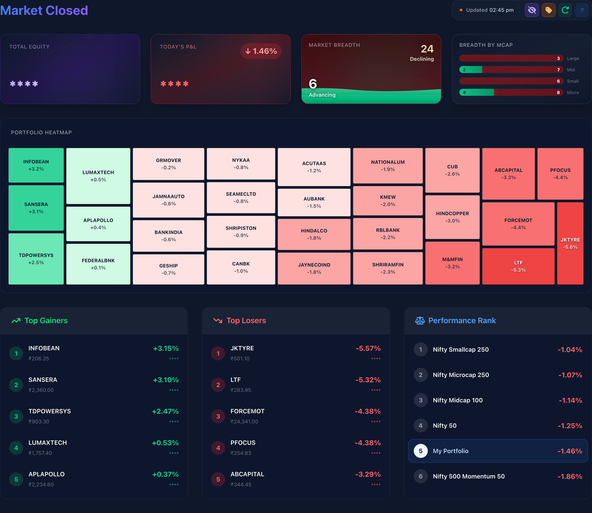

# Alpha Portfolio Tracker

<p align="center">
  A self-hosted portfolio tracker for Indian equity markets — live P&amp;L, performance analytics, and a daily NSE momentum screener.
</p>

<div align="center">
  
  <br />
  <sub><em>Live Dashboard — real-time P&amp;L, portfolio heatmap &amp; intraday chart</em></sub>
</div>

<br />

<div align="center">
  <details>
    <summary><b>📊 View the full Historical Dashboard</b></summary>
    <br />
    
    <br />
    <sub><em>Historical Dashboard — NAV, XIRR, drawdown &amp; benchmark comparisons</em></sub>
  </details>
</div>

A self-hosted portfolio tracking application for Indian stock markets with real-time market data, historical performance analysis, and comprehensive reporting. Built with Next.js and powered by Upstox API.

> [!NOTE]
> This project has been tested with **Upstox** (for real-time market data, historical prices, and authentication) and **Zerodha Kite** (for order import only). If you use a different broker, you can still use the app by importing trades via Excel, but real-time data and order sync features may require code changes to support your broker's API.

---

## ✨ Features

- **Real-time Dashboard** — Live portfolio P&L with WebSocket price streaming from Upstox
- **Momentum Screener** — Daily-ranked NSE universe using composite Sharpe ratio scoring with ATH proximity filters, plus exit signal detection for portfolio holdings
- **Radar — Volume-Breakout Scanner** — Live candlestick charts with volume-breakout/breakdown detection, HH/HL/LH/LL swing marking, and a ranked, sortable list across your holdings + a personal watchlist (`1m`→`1M` timeframes)
- **Privacy Mode** — Toggle to hide monetary values on desktop (great for screen sharing)
- **Performance Analytics** — NAV tracking, XIRR, drawdown, benchmark comparisons (NIFTY 50, NIFTY 500 MOMENTUM 50, etc.)
- **Market Cap Classification** — Automatic Large/Mid/Small/Micro cap breakdown using AMFI data
- **Sector Allocation** — Visual treemap and pie charts showing portfolio sector exposure
- **Portfolio Heatmap** — Treemap, animated donut **Allocation** view, and diverging **Bars** view of holding performance, with an interactive scroll-synced legend
- **Intraday P&L Chart** — Minute-by-minute P&L tracking with index overlay
- **Corporate Actions** — Track stock splits, bonuses, and symbol changes with automatic price adjustments
- **Trade Import** — Bulk import trades from Excel/CSV files
- **Historical Snapshots** — Daily, weekly, and monthly portfolio snapshots with time-weighted returns
- **Data Lock** — Protect historical data from accidental recalculation

---

## 🚀 Getting Started

This section walks you through setting up Alpha from scratch. Follow the steps in order.

### ✅ Pre-flight Checklist

Before you begin, make sure you have:

- [ ] **Node.js v20+** installed — check with `node -v` ([download here](https://nodejs.org/))
- [ ] An **Upstox demat account** — needed for market data
- [ ] A **Turso account** — for the database ([sign up free](https://turso.tech/))
- [ ] A **Vercel account** — if you plan to deploy ([vercel.com](https://vercel.com/))

> [!TIP]
> You can run the app entirely locally without Vercel. Vercel is only needed for cloud deployment.

---

### Step 1 — Get Your Upstox Analytics Token

The app uses Upstox for real-time prices, historical data, and WebSocket streaming. All of this requires a single long-lived token.

1. Go to [developer.upstox.com](https://developer.upstox.com/) and sign in with your Upstox credentials
2. Navigate to the **Analytics** tab on your Developer Apps page
3. Click **"Generate Token"** and confirm
4. **Copy the token** — you will need it in Step 4

> [!TIP]
> The Analytics Token is read-only with 1-year validity. No OAuth app, no redirect URLs, and no daily token refresh. See [Upstox docs](https://upstox.com/developer/api-documentation/analytics-token/) for details.

---

### Step 2 — Create a Turso Database

Turso stores all your portfolio data, snapshots, and screener history. There are two ways to set it up — pick whichever suits you.

#### Option A — Vercel Marketplace *(recommended if deploying to Vercel)*

This is the easiest route. Vercel provisions a Turso database and injects the credentials automatically.

1. Go to your Vercel project → **Storage** tab → **Connect Database**
2. Choose **Turso** from the marketplace
3. Click **Create & Connect** — Vercel creates the database and injects `TURSO_DATABASE_URL` and `TURSO_AUTH_TOKEN` into your project's environment automatically
4. That's it. No manual credential copying needed.

> [!TIP]
> The app accepts both `DATABASE_URL` and `TURSO_DATABASE_URL`, so the Vercel integration works without any extra configuration.

#### Option B — Manual setup *(CLI or Turso dashboard)*

1. Sign up at [turso.tech](https://turso.tech/)

2. **Install the Turso CLI**:
   ```bash
   curl -sSfL https://get.tur.so/install.sh | bash
   turso auth login
   ```
   Alternatively, use the web dashboard at [app.turso.tech](https://app.turso.tech/)

3. **Create a new database**:
   ```bash
   turso db create alpha-portfolio
   ```

4. **Get your connection credentials**:
   ```bash
   # Database URL (looks like libsql://alpha-portfolio-<user>.turso.io)
   turso db show alpha-portfolio --url

   # Auth token
   turso db tokens create alpha-portfolio
   ```
   Copy both values and add them to `.env.local` in Step 4 as `DATABASE_URL` and `TURSO_AUTH_TOKEN`.

<details>
<summary>💰 Turso Free Tier Limits</summary>

| Feature | Free Tier |
|---------|-----------|
| Storage | **5 GB** |
| Databases | Up to 100 |
| Row Reads | 500 million/month |
| Row Writes | 10 million/month |

Turso's free tier is extremely generous with **5 GB of storage** and no auto-suspend — zero cold-start delays!

</details>

---

### Step 3 — Clone the Repository

```bash
# Clone the project
git clone https://github.com/<your-username>/Alpha.git
cd Alpha
```

---

### Step 4 — Configure Environment Variables

Copy the example files and fill in your values:

```bash
cp .env.local.example .env.local
cp .env.example .env
```

Open `.env.local` in your editor and fill in the three required values:

```bash
# REQUIRED
DATABASE_URL=libsql://your-database.turso.io
TURSO_AUTH_TOKEN=your-auth-token
UPSTOX_ANALYTICS_TOKEN=your-analytics-token

# OPTIONAL — your name shown in the UI
# APP_USER_NAME=YourName
# NEXT_PUBLIC_APP_USER_NAME=YourName

# OPTIONAL — secret to protect cron endpoints (recommended for production)
# CRON_SECRET=any-random-string-you-choose

# OPTIONAL — Zerodha Kite (only if you want auto order sync)
# ZERODHA_USER_ID=your-user-id
# ZERODHA_PASSWORD=your-password
# ZERODHA_TOTP_SECRET=your-totp-secret
# ZERODHA_API_KEY=your-kite-api-key
# ZERODHA_API_SECRET=your-kite-api-secret
```

> [!IMPORTANT]
> The three `REQUIRED` values must be set before proceeding. The app will not start correctly without them.

---

### Step 5 — Install Dependencies & Initialize the Database

```bash
# Install Node.js dependencies
npm install

# Apply the database schema to Turso (creates all tables)
npx tsx scripts/apply-turso-schema.ts
```

> [!IMPORTANT]
> You **must** run the schema setup before starting the app. If you skip this, you will see `no such table` errors. If this command fails, double-check `DATABASE_URL` and `TURSO_AUTH_TOKEN` in `.env.local`.

<details>
<summary>🔧 Troubleshooting: Common Turso connection errors</summary>

| Error | Cause | Fix |
|-------|-------|-----|
| `no such table` | Schema was never applied | Run `npx tsx scripts/apply-turso-schema.ts` |
| `Can't reach database server` | Wrong URL or token | Re-verify `DATABASE_URL` and `TURSO_AUTH_TOKEN` in `.env.local` |
| `LIBSQL_CLIENT_ERROR` | Malformed connection string | Ensure URL starts with `libsql://` (not `https://`) |

</details>

---

### Step 6 — Run the App Locally

```bash
npm run dev
```

Open [http://localhost:3000](http://localhost:3000) in your browser. The app picks up your Analytics Token from `.env.local` automatically — no login needed.

---

### Step 7 — Import Your Trades

Go to the **Trades** page (`/trades`) and upload an Excel file with your trade history.

**Expected column format:**

| Column | Description | Example |
|--------|-------------|---------|
| Date | Trade date | `15-01-2024` or `2024-01-15` |
| Symbol | NSE trading symbol | `RELIANCE`, `TCS` |
| Type | Direction | `BUY` or `SELL` |
| Quantity | Number of shares | `10` |
| Price | Price per share (₹) | `2800.50` |

After import, the app automatically:
- Processes all transactions chronologically
- Fetches historical closing prices from Upstox API
- Calculates daily NAV using Time-Weighted Return (TWR)
- Generates daily, weekly, and monthly snapshots
- Compares performance against benchmark indices

---

### Step 8 — (Optional) Set Up the Momentum Screener

The screener requires a one-time backfill of historical price data (~30–45 minutes total). Only do this if you want to use the Screener feature.

> [!IMPORTANT]
> Run these scripts in order. Each step depends on the previous.

```bash
# 1. Backfill ~18 months of daily candles for all NSE stocks (~30 min)
npx tsx scripts/seed-screener-prices.ts

# 2. Seed all-time highs from monthly candles since 2000 (~7 min)
npx tsx scripts/seed-ath.ts

# 3. Score and rank all stocks (first run)
npx tsx scripts/run-pipeline.ts

# 4. Backfill 50 days of ranking history (~5 min)
npx tsx src/scripts/backfill-rank-history.ts
```

After the backfill, the daily cron job keeps everything up to date automatically.

---

## ☁️ Deploy to Vercel

### Step 1 — Push to GitHub

```bash
git init
git add .
git commit -m "Initial commit"
git remote add origin https://github.com/<your-username>/Alpha.git
git push -u origin main
```

### Step 2 — Import to Vercel

1. Go to [vercel.com](https://vercel.com/) and sign in
2. Click **"New Project"** → Import your GitHub repository
3. In **Environment Variables**, add the following:

| Variable | Value | Notes |
|----------|-------|-------|
| `DATABASE_URL` | `libsql://your-database.turso.io` | Turso database URL |
| `TURSO_AUTH_TOKEN` | `your-auth-token` | Mark as **Sensitive** |
| `UPSTOX_ANALYTICS_TOKEN` | Your analytics token | Mark as **Sensitive** |
| `CRON_SECRET` | Any random string | Required for cron endpoint authentication |

> [!TIP]
> If you are using the optional **Zerodha Order Sync**, also add the `ZERODHA_*` variables from the [Environment Variables Reference](#-environment-variables-reference) below.

4. Click **Deploy**

### Step 3 — Set Up Cron Jobs

The app uses external cron jobs to automate daily tasks. Use [cron-job.org](https://cron-job.org/) (free tier is sufficient).

#### How to set up on cron-job.org

1. Sign up at [cron-job.org](https://cron-job.org/)
2. Click **"Create cronjob"**
3. For each job below, fill in:
   - **Title**: A descriptive name (e.g., "Alpha - Daily Snapshot")
   - **URL**: `https://your-app.vercel.app` + the endpoint path + `?secret=YOUR_CRON_SECRET`
   - **Schedule**: Use the "Custom" option and paste the cron expression
   - **Time zone**: Set to **UTC** for all jobs
   - **Request method**: **GET**
   - **Notifications**: Enable "on failure"
4. Click **"Create"** and repeat for each endpoint

> [!IMPORTANT]
> All cron endpoints require authentication. Append `?secret=YOUR_CRON_SECRET` to each URL. This must match the `CRON_SECRET` set in your Vercel environment variables.

#### Cron Jobs to Configure

| # | Title | Endpoint | Schedule (UTC) | IST | What it does |
|---|-------|----------|----------------|-----|--------------|
| 1 | Intraday P/L | `/api/cron/intraday-pnl` | `* 4-10 * * 1-5` | Every min, 9:30am–4:00pm | Records P&L every minute for the Intraday chart |
| 2 | Daily Snapshot | `/api/portfolio/snapshot?type=daily` | `30 10 * * 1-5` | 4:00 PM Mon–Fri | End-of-day portfolio value, NAV, drawdown |
| 3 | Weekly Snapshot | `/api/portfolio/snapshot?type=weekly` | `0 11 * * 5` | 4:30 PM Fri | Weekly state (market cap, sector, XIRR) |
| 4 | Monthly Snapshot | `/api/portfolio/snapshot?type=month` | `0 0 1 * *` | 5:30 AM 1st of month | Monthly state with full performance stats |
| 5 | Corp Actions | `/api/cron/corporate-actions` | `30 23 * * *` | 5:00 AM Daily | Syncs splits and bonuses from NSE |
| 6 | Sector Refresh | `/api/cron/sector-refresh` | `0 6 1 * *` | 11:30 AM 1st of month | Updates stock-to-sector mappings |
| 7 | AMFI Sync | `/api/cron/amfi-sync` | `30 0 * * 0` | 6:00 AM Sunday | Checks for new market cap classifications |
| 8 | Momentum Screener | `/api/cron/momentum-screener` | `0 11 * * 1-5` | 4:30 PM Mon–Fri | Scores and ranks all stocks |
| 9 | Daily Email Report | `/api/cron/daily-report` | `0 11 * * 1-5` | 4:30 PM Mon–Fri | *(Optional)* Sends portfolio + screener summary email via Resend. Requires `RESEND_API_KEY` and `REPORT_EMAIL_TO`. |

> [!TIP]
> After creating all jobs, click **"Run now"** in cron-job.org to manually trigger any job and verify it's working.

---

## ⚙️ Settings Page

The Settings page (`/settings`) is your control center for managing the app:

### Upstox Authentication

Set `UPSTOX_ANALYTICS_TOKEN` in `.env.local`. The Analytics Token is a long-lived (1-year) read-only token — no login, no refresh, no cron jobs needed. The Settings page shows the token status.

### Data Lock

Set a date to protect all historical snapshot data before that date from being modified or recalculated. Useful once you have verified your historical data is correct.

### Recompute Snapshots

Trigger a full recalculation of portfolio snapshots from your trade history. This processes all transactions chronologically, fetches prices, and regenerates all daily/weekly/monthly snapshots. Use this after importing new trades or fixing data issues.

### Refresh Sector Data

Fetches the latest stock-to-sector mappings (scrapes from Zerodha). This data powers the sector allocation charts. Runs automatically monthly via cron, but can be triggered manually.

---

## 📊 AMFI Market Cap Classification

The app classifies your holdings into Large Cap, Mid Cap, Small Cap, and Micro Cap using official AMFI data.

### How to Upload AMFI Data

1. Download the AMFI classification PDF from [amfiindia.com](https://www.amfiindia.com/research-information/other-data/categorization-of-stocks)
2. Go to **Settings** → **AMFI Classification** card
3. Upload the PDF file
4. The app parses it and stores classifications by period (e.g., `2024_H2`)

### Classification Logic

- AMFI releases data twice a year (H1 and H2)
- The **rolling period** logic ensures the previous period's data applies to the current period's snapshots (e.g., `2024_H2` data determines classifications until `2025_H1` data is available)
- **SEBI thresholds**: Large Cap (rank 1–100), Mid Cap (101–250), Small Cap (251–500), Micro Cap (501+)

After uploading new AMFI data, snapshots are automatically recalculated to update the market cap breakdown.

---

## 🏢 Corporate Actions

Go to **Settings** → **Corporate Actions** to manage stock splits, bonuses, and symbol changes.

### Supported Types

| Type | Description | Example |
|------|-------------|---------|
| **SPLIT** | Stock split — adjusts quantity and price | 1:5 split → 100 shares become 500 at 1/5th price |
| **BONUS** | Bonus shares — adds new shares at zero cost | 1:1 bonus → 100 shares become 200 |
| **SYMBOL_CHANGE** | Symbol rename — maps old symbol to new | MCDOWELL-N → UBBL |

### How It Works

1. Add the corporate action with the date, symbol, type, and ratio
2. The app automatically adjusts historical prices and quantities in snapshot calculations
3. No need to modify your original trade data — adjustments are applied during portfolio simulation

> [!NOTE]
> Corporate actions are not auto-detected from any API. You need to manually enter them when they occur for your holdings.

---

## 🕶️ Privacy Mode

Click the **eye icon** in the live dashboard header to toggle privacy mode:
- **On**: All monetary values (portfolio value, P&L, stock values) are masked with `****` on desktop
- **Off**: All values are visible
- **Mobile**: Values are always shown regardless of privacy setting (since you are on your personal device)
- The setting persists across sessions via `localStorage`

---

## 📈 Momentum Screener

Scores the full NSE equity universe daily after market close. Mirrors the backtest engine exactly.

### Formula

```
Composite Score = avgSharpe = mean(Sharpe_12m, Sharpe_6m, Sharpe_3m)
```

- **Sharpe** = (mean daily return × 252) / (std × √252) — annualized, sample std, risk-free rate = 0
- **12-month**: 252 trading days ending today
- **6-month**: 126 trading days ending today
- **3-month**: 62 trading days ending **21 days ago** (effectively a 4m→1m window — the most recent month is skipped to reduce noise from mean reversion)
- **ATH proximity** is an **entry filter** (≥70% of ATH), **not** a score component

### Filters (all must pass)

| Filter | Threshold |
|--------|-----------|
| Market cap | ≥ ₹1,000 Cr (NSE Bhavcopy) |
| Price | ≥ ₹50 (ETFs GOLDBEES/SILVERBEES exempt) |
| 200 DMA | Close ≥ 200-day SMA |
| ATH proximity | Within 30% of all-time high |
| Volume | Median daily turnover ≥ ₹1 Cr (126-day lookback) |
| Circuit band | ≥ 15% (excludes 2%/5% circuit stocks) |
| History | ≥ 269 trading days of data (252 + 21 skip days) |

### Exit & Warning Signals

Portfolio holdings are evaluated daily against the momentum screener criteria to generate either a **Red (Exit)** or **Yellow (Warning)** signal:

#### 🔴 Red (Exit Signal)
Indicates an immediate recommendation to sell. Triggered if any of the following apply:
- **Major Filter Breach**: Close is below 200 DMA **AND** $> 25\%$ below ATH (`athProximity < 0.75`) simultaneously.
- **Major Rank Drop**: The stock's rank drops $> 60$.
- **Fell Out of Universe**: The stock is unranked for reasons other than being in the BE category.

#### 🟡 Yellow (Warning Signal)
Indicates a warning condition. The stock is not in a Red state, but matches any of the following:
- **Below 50 DMA**: Close is below the 50-day simple moving average.
- **Moderate Rank Drop**: The stock's rank is between 51 and 60.
- **BE Category**: The stock is unranked specifically because it belongs to the "BE category" (Trade-to-Trade).

#### 🔒 Min Hold Protection (Lock)
- Holdings held for **$< 14$ days** are **LOCKED** (minimum hold protection, displayed with a yellow lock icon in the UI). Exit and Warning signals are suppressed/ignored during this lock window to prevent premature exits.

---

## 📡 Radar — Volume-Breakout Scanner

A live candlestick + volume-breakout scanner (menu: **Radar**) that ranks your holdings alongside a personal watchlist by breakout strength.

### What it does
- **Candlestick chart** for the selected symbol with **Donchian(20)** breakout/breakdown levels, **HH / HL / LH / LL** swing markers, and a dashed marker at the candle where the current breakout/breakdown began.
- **Ranked scanner list** — every symbol is scored and sorted so the strongest moves surface first.
- **Sortable** by **Strength** (default), **BO** (breakouts first), **BD** (breakdowns first), or **A–Z**.
- **Timeframes**: `1m · 5m · 15m · 30m · 1h · 4h · 1D · 1W · 1M` (default `1D`), built by resampling native Upstox candles.
- **Live toggle** — pause auto-refresh + live ticks to study a frozen last-session chart on weekends/holidays; resume to fold live LTP into the forming candle.
- **Personal watchlist** — add/remove your own symbols (validated against the Upstox instrument master). New symbols show an *Adding…* state, then auto-scroll + glow their row once the scan surfaces them. Persisted in the DB (`RadarWatchlist`) for cross-device sync, with a localStorage cache for instant paint + offline fallback.

### Ranking formula
Each symbol's score is `volumeRatio × (1 + |distanceFromLevel%| / 5)`, signed negative for breakdowns. `volumeRatio` is the latest volume vs the trailing average; `distanceFromLevel%` is how decisively price cleared the Donchian band. Default sort is by **magnitude** (either direction); use the sort buttons to group by direction.

---

## 🏗️ Architecture

<details>
<summary>Click to expand</summary>

### Tech Stack

- **Framework**: Next.js 16 (App Router, Turbopack)
- **Database**: Turso (libSQL/SQLite)
- **ORM**: Prisma
- **Market Data**: Upstox API (REST + WebSocket)
- **Styling**: TailwindCSS + Material UI
- **Charts**: Recharts + Nivo

### Architecture Diagram

```
┌─────────────────────────────────────────────────────────────────────┐
│                     Frontend (Next.js App Router)                    │
├─────────────────────────────────────────────────────────────────────┤
│  Live Dashboard │ Historical Dashboard │ Trades │ Settings          │
│       │                │                   │         │              │
│       └────────────────┴───────────────────┴─────────┘              │
│                              │                                      │
│                    Server Actions / API Routes                      │
├─────────────────────────────────────────────────────────────────────┤
│                           Service Layer                             │
│  ┌─────────┐ ┌─────────┐ ┌─────────┐ ┌─────────┐ ┌─────────┐     │
│  │ Upstox  │ │  AMFI   │ │ Finance │ │ Import  │ │ Sector  │     │
│  │ Service │ │ Service │ │ Engine  │ │ Service │ │ Service │     │
│  └────┬────┘ └────┬────┘ └────┬────┘ └────┬────┘ └────┬────┘     │
├───────┼──────────┼──────────┼──────────┼──────────┼─────────────────┤
│  ┌────▼────┐ ┌───▼───┐ ┌───▼───┐ ┌───▼───┐ ┌───▼───┐             │
│  │ Upstox  │ │ AMFI  │ │Prisma │ │ Excel │ │Zerodha│             │
│  │   API   │ │ Files │ │  ORM  │ │ Parse │ │ Scrape│             │
│  └─────────┘ └───────┘ └───┬───┘ └───────┘ └───────┘             │
├──────────────────────────────┼──────────────────────────────────────┤
│                        ┌─────▼─────┐                                │
│                        │   Turso   │                                │
│                        │  libSQL   │                                │
│                        └───────────┘                                │
└─────────────────────────────────────────────────────────────────────┘
```

### Directory Structure

```
src/
├── app/                    # Next.js App Router pages
│   ├── actions/           # Server Actions
│   │   ├── actions.ts     # Core portfolio actions
│   │   ├── screener.ts    # Screener data & exit signal detection
│   │   ├── auth.ts        # Authentication actions
│   │   ├── amfi.ts        # AMFI classification actions
│   │   ├── live.ts        # Live dashboard data
│   │   └── sectors.ts     # Sector mapping actions
│   ├── api/               # API Routes
│   │   ├── cron/          # Scheduled jobs (snapshot, screener, sector, corp actions)
│   │   ├── stream/        # WebSocket authorization
│   │   └── portfolio/     # Snapshot generation
│   │   └── charts.ts      # Radar: candles, breakout scan, watchlist actions
│   ├── screener/          # Momentum screener page
│   ├── radar/             # Radar breakout-scanner page
│   ├── dashboard/         # Historical dashboard page
│   ├── settings/          # Settings page (auth, AMFI, corp actions)
│   └── trades/            # Trade management & import
├── components/            # React components
│   ├── screener/          # ScreenerClient, StatsBar, RulesInfoModal
│   ├── radar/             # RadarClient, CandlestickChart, BreakoutList
│   ├── live/              # LiveHeader, LiveStatsCards, LiveMovers, IntradayPnLChart
│   └── portfolio/         # PortfolioTable, Heatmap (treemap/donut/bars), SectorAllocation
├── context/
│   └── LiveDataContext.tsx # WebSocket + polling data provider
├── hooks/
│   ├── useUpstoxStream.ts # WebSocket connection to Upstox (Protobuf V3)
│   └── useWatchlist.ts    # DB-backed Radar watchlist (localStorage cache)
└── lib/                   # Core library code
    ├── charts/            # Pure candle/indicator utils (resample, Donchian, pivots)
    ├── screener/          # Momentum screener pipeline
    │   ├── pipeline.ts    # Daily orchestrator (candles → score → rank → store)
    │   ├── scoring.ts     # Sharpe + composite score (mirrors backtest engine.py)
    │   ├── prices.ts      # Incremental candle ingestion from Upstox
    │   ├── ath.ts         # All-time high tracking
    │   ├── bhavcopy.ts    # NSE market cap from daily ZIP archives
    │   ├── corporate-actions.ts # Split/bonus detection via price anomalies
    │   ├── dates.ts       # IST date utilities
    │   └── utils.ts       # Shared withConcurrency / withRetry helpers
    ├── upstox/            # Upstox API client & token management
    ├── amfi/              # AMFI classification service
    ├── finance/           # Portfolio valuation engine
    ├── portfolio-engine.ts # Transaction processing
    ├── finance.ts         # Snapshot calculations
    └── db.ts              # Database connection
```

### Database Schema

**Core Tables**: Transaction, DailyPortfolioSnapshot, WeeklyPortfolioSnapshot, MonthlyPortfolioSnapshot

**Support Tables**: StockHistory, IndexHistory, SymbolMapping, AMFIClassification, SectorMapping, UpstoxToken, IntradayPnL, Dividend, RadarWatchlist

### Real-time Data Flow

```
Page Load → Fetch initial data (Server Action)
               │
               ▼
          Start WebSocket (useUpstoxStream)
               │
               ▼
          Receive price updates → Update holdings → Recalculate totals
```

The browser connects directly to Upstox WebSocket (protobuf messages decoded client-side). This avoids serverless connection limits while providing sub-second price updates.

### Snapshot Calculation

Portfolio history is built through simulation:
1. Process transactions chronologically
2. Fetch daily closing prices from Upstox
3. Apply corporate action adjustments
4. Calculate NAV using Time-Weighted Return (TWR)
5. Save daily/weekly/monthly snapshots
6. Track index benchmarks for comparison

</details>

---

## 🔧 Optional: Zerodha Kite Integration

Auto-syncs today's executed orders from Zerodha Kite into the app every weekday at 3:45 PM IST (following the 3:40 PM closing auction session).

> [!NOTE]
> Auto-sync only imports the **current day's executed orders** — it does not import historical trades. For your existing trade history, use the Excel import on the Trades page.

### How the sync flow works

Because Zerodha's Kite login requires Puppeteer (a headless browser), it cannot run inside Vercel Serverless Functions. The flow is:

```
Vercel Cron (3:45 PM IST) → /api/cron/sync-orders
                                    │
                                    │  dispatches workflow via GitHub API
                                    ▼
                        GitHub Actions (sync-orders.yml)
                                    │
                                    │  Puppeteer logs into Kite, fetches orders
                                    ▼
                        Writes to Turso DB → triggers Vercel cache revalidation
```

### Setup Steps

**Step 1 — Create a Kite Connect app**
1. Go to [kite.trade](https://kite.trade/) → **My Apps** → **Create App**
2. Copy the **API Key** and **API Secret**

**Step 2 — Add credentials to `.env.local`** (for local testing):
```bash
ZERODHA_USER_ID=your-zerodha-client-id
ZERODHA_PASSWORD=your-zerodha-password
ZERODHA_TOTP_SECRET=your-totp-secret        # The raw TOTP secret, NOT the 6-digit code
ZERODHA_API_KEY=your-kite-api-key
ZERODHA_API_SECRET=your-kite-api-secret
```

> [!TIP]
> To get your `ZERODHA_TOTP_SECRET`: when setting up 2FA in Zerodha, choose "authenticator app" and look for the option to reveal/copy the raw secret key (instead of scanning the QR code).

**Step 3 — Add GitHub Repository Secrets**

Go to your GitHub repo → **Settings → Secrets and variables → Actions → New repository secret** and add:

| Secret | Value |
|--------|-------|
| `DATABASE_URL` | Your Turso `libsql://` URL |
| `TURSO_AUTH_TOKEN` | Your Turso auth token |
| `ZERODHA_USER_ID` | Your Zerodha client ID |
| `ZERODHA_PASSWORD` | Your Zerodha account password |
| `ZERODHA_TOTP_SECRET` | Raw TOTP secret (not the 6-digit code) |
| `ZERODHA_API_KEY` | From kite.trade developer console |
| `ZERODHA_API_SECRET` | From kite.trade developer console |
| `NEXT_APP_URL` | Your Vercel deployment URL e.g. `https://your-app.vercel.app` — used to trigger cache revalidation after sync |

**Step 4 — Add Vercel environment variables** (so the app can dispatch the workflow):

| Variable | Value |
|----------|-------|
| `GITHUB_PAT` | A GitHub Personal Access Token with the `workflow` scope |

> [!TIP]
> Create a PAT at GitHub → **Settings → Developer settings → Personal access tokens (classic)** → select `workflow` scope.

**Step 5 — (Optional) Test locally**:
```bash
npx tsx src/scripts/zerodha-cron.ts
```

---

## 📧 Optional: Daily Email Report

Sends a daily end-of-day portfolio summary email after market close, including:
- Portfolio value, day P&L, XIRR
- Top movers and current holdings
- Screener entry and exit signals
- *(Optional)* AI-generated narrative summary via Groq

### Setup

**Step 1 — Get a Resend API key**

Sign up at [resend.com](https://resend.com) (free tier: 100 emails/day). Copy your API key.

**Step 2 — Add env variables** (`.env.local` + Vercel):

```bash
RESEND_API_KEY=re_your-resend-api-key
REPORT_EMAIL_TO=you@example.com

# Optional: use your own verified sender domain
# REPORT_EMAIL_FROM=portfolio@yourdomain.com

# Optional: AI summary via Groq (https://groq.com)
# GROQ_API_KEY=your-groq-api-key
# GROQ_MODEL=llama-3.3-70b-versatile
```

**Step 3 — Add a cron job** on [cron-job.org](https://cron-job.org):

| Field | Value |
|-------|-------|
| URL | `https://your-app.vercel.app/api/cron/daily-report?secret=YOUR_CRON_SECRET` |
| Schedule | `0 11 * * 1-5` |
| Time zone | UTC (= 4:30 PM IST) |

> [!TIP]
> Append `?force=true` to the URL to send a test email even on weekends or holidays.

---

## 🔑 Environment Variables Reference

### Required — Core App

| Variable | Where to set | Description |
|----------|-------------|-------------|
| `DATABASE_URL` | `.env.local` + Vercel | Turso database URL — must start with `libsql://`. Use this when setting up manually. |
| `TURSO_DATABASE_URL` | Vercel only | Injected automatically by the **Vercel Marketplace Turso integration**. The app accepts this as a fallback for `DATABASE_URL` — no manual setup needed if using Option A. |
| `TURSO_AUTH_TOKEN` | `.env.local` + Vercel | Turso authentication token. Injected automatically by the Vercel integration, or copy it from the CLI/dashboard for manual setup. |
| `UPSTOX_ANALYTICS_TOKEN` | `.env.local` + Vercel | Long-lived (1-year) read-only token from Developer Apps → Analytics tab |

### Strongly Recommended

| Variable | Where to set | Description |
|----------|-------------|-------------|
| `CRON_SECRET` | `.env.local` + Vercel | Secures all `/api/cron/*`, `/api/recompute`, and `/api/revalidate` endpoints. Pass as `?secret=` query param or `Authorization: Bearer` header. Without it, any request is accepted. |

### Optional — Personalization

| Variable | Where to set | Description |
|----------|-------------|-------------|
| `APP_USER_NAME` | `.env.local` + Vercel | Your name shown in server-rendered UI components. Defaults to `"User"`. |
| `NEXT_PUBLIC_APP_USER_NAME` | `.env.local` + Vercel | Same as above, but exposed to client-side React components. Must have the `NEXT_PUBLIC_` prefix. |
| `NEXT_PUBLIC_APP_VERSION` | `.env.local` + Vercel | Cache buster for React Query's persisted client-side cache. Defaults to `"v1"`. Increment this to invalidate stale cached data on clients. |
| `DATA_LOCK_DATE` | `.env.local` + Vercel | Hard-code a data lock date (format: `YYYY-MM-DD`) as an env-level fallback. Normally managed via the Settings UI (stored in DB). |
| `USE_UPSTOX` | `.env.local` | Set to `"false"` to disable all Upstox API calls. Useful for offline development and testing. Defaults to `true`. |

### Optional — Zerodha Order Sync (`.env.local` + Vercel)

| Variable | Description |
|----------|-------------|
| `ZERODHA_USER_ID` | Your Zerodha client ID |
| `ZERODHA_PASSWORD` | Your Zerodha account password |
| `ZERODHA_TOTP_SECRET` | Raw TOTP secret for automated 2FA (not the 6-digit code) |
| `ZERODHA_API_KEY` | Kite Connect API key from kite.trade |
| `ZERODHA_API_SECRET` | Kite Connect API secret from kite.trade |
| `GITHUB_PAT` | GitHub Personal Access Token with `workflow` scope. Required for the Vercel app to dispatch the sync GitHub Action. |
| `GITHUB_REPO_OWNER` | Your GitHub username. Only needed if **not** deployed on Vercel (Vercel auto-injects `VERCEL_GIT_REPO_OWNER`). |
| `GITHUB_REPO_NAME` | Your repository name. Only needed if **not** deployed on Vercel (Vercel auto-injects `VERCEL_GIT_REPO_SLUG`). |

### Optional — Daily Email Report (`.env.local` + Vercel)

Required only if you set up the `/api/cron/daily-report` cron job.

| Variable | Description |
|----------|-------------|
| `RESEND_API_KEY` | API key from [resend.com](https://resend.com). Required to send emails. |
| `REPORT_EMAIL_TO` | Recipient email address for the daily report. |
| `REPORT_EMAIL_FROM` | Sender address. Defaults to `onboarding@resend.dev` (Resend sandbox). Use a verified domain in production. |
| `GROQ_API_KEY` | *(Optional within this feature)* API key from [groq.com](https://groq.com). If set, the email includes an AI-generated portfolio summary. |
| `GROQ_MODEL` | *(Optional)* Groq model name. Defaults to `llama-3.3-70b-versatile`. |

### GitHub Actions Repository Secrets

Required in your GitHub repo → **Settings → Secrets and variables → Actions** for the `sync-orders.yml` workflow:

| Secret | Description |
|--------|-------------|
| `DATABASE_URL` | Same Turso `libsql://` URL |
| `TURSO_AUTH_TOKEN` | Same Turso auth token |
| `ZERODHA_USER_ID` | Zerodha client ID |
| `ZERODHA_PASSWORD` | Zerodha account password |
| `ZERODHA_TOTP_SECRET` | Raw TOTP secret |
| `ZERODHA_API_KEY` | Kite Connect API key |
| `ZERODHA_API_SECRET` | Kite Connect API secret |
| `NEXT_APP_URL` | *(Optional)* Your Vercel URL e.g. `https://your-app.vercel.app`. Triggers cache revalidation after a successful sync. |

---

## ❓ Troubleshooting & Known Limitations

### Troubleshooting

| Problem | Solution |
|---------|----------|
| `no such table` | Run `npx tsx scripts/apply-turso-schema.ts` to create tables |
| Screener shows 0 stocks | Run the one-time backfill scripts (see [Screener Setup](#step-8--optional-set-up-the-momentum-screener)) |
| Stale data after cron runs | Check that `CRON_SECRET` matches between Vercel env and cron-job.org URLs |
| `prisma generate` errors | Run `npm install` first, then `npx prisma generate` |
| `LIBSQL_CLIENT_ERROR` | Ensure `DATABASE_URL` starts with `libsql://` (not `https://`) |

### Known Limitations

1. **Index History** — NIFTY500 MOMENTUM 50 historical data before Sep 30, 2024 requires CSV backfill
2. **Corporate Actions** — Must be manually entered (no API auto-detection for splits/bonuses)
3. **Real-time WebSocket** — May disconnect during market hours; auto-reconnect handles this
4. **AMFI Data** — PDF upload is manual; AMFI releases classification data twice per year

---

## 📱 Android App Setup

This project uses [Capacitor](https://capacitorjs.com/) to wrap the web app into a native Android application.

### Prerequisites for Android
- [Android Studio](https://developer.android.com/studio) installed and configured
- Android SDK & Emulators setup in Android Studio

### Build & Run Android App

1. **Build the Web App**
   First, create a production build of the Next.js application:
   ```bash
   npm run build
   ```

2. **Sync and Open in Android Studio**
   ```bash
   npm run android:build
   ```
   *(This runs `npx cap sync android` followed by `npx cap open android`)*

3. **Run on Device / Emulator**
   Once Android Studio opens:
   - Wait for gradle to finish syncing
   - Select your target device or emulator from the toolbar
   - Click the **Play** button (Run 'app') to build and launch the app

> [!NOTE]
> The `.env.local` variables must be configured correctly before running `npm run build` so that the frontend has the correct API URLs and settings baked in for the mobile app.

---

## 🧑‍💻 Development

```bash
npm run dev          # Start development server
npm run build        # Production build
npm run lint         # Run ESLint
npx prisma generate  # Regenerate Prisma client
npx prisma db push   # Push schema changes to database
npx prisma studio    # Open Prisma Studio (DB browser)
```

---

## 📄 License

Private - All rights reserved.
